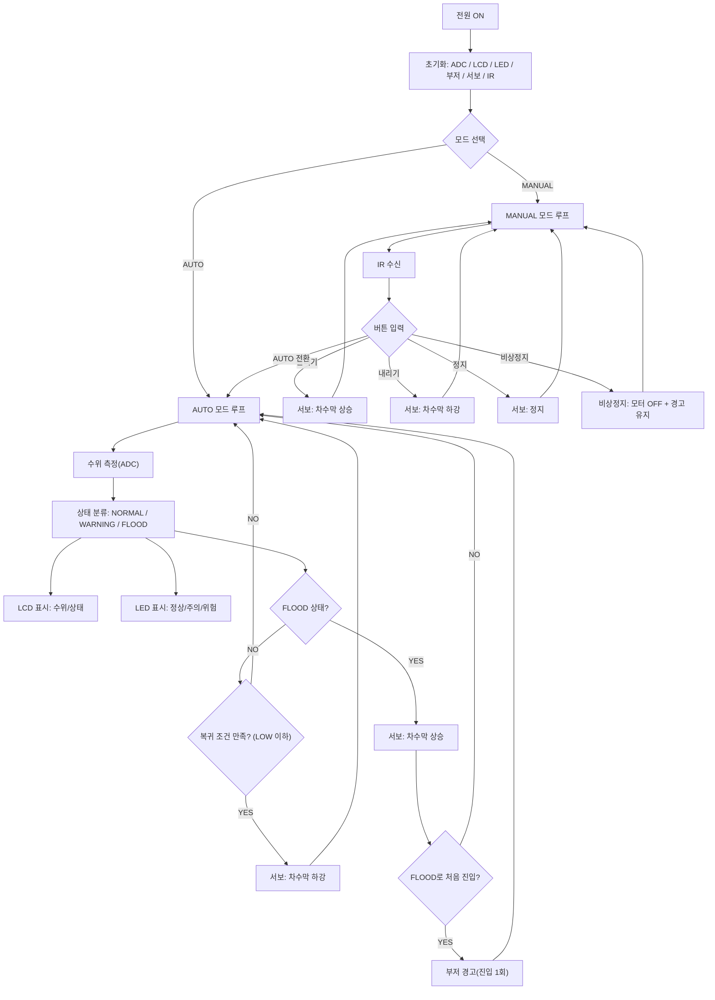

# Flood Barrier (스마트 차수막 시스템 & IoT 모니터링)


**STM32**로 수위를 감지해 차수막(서보모터)을 제어하고, **Raspberry Pi**에서 UART 데이터를 수집하여 **MariaDB에 저장**한 뒤 **GUI(Tkinter)** 로 시각화하는 통합 침수 방지 시스템입니다.

- **현장(Embedded)**: 자동/수동 제어 + LCD/LED/부저 경고  
- **관제(IoT/Monitoring)**: 실시간 로깅 + PC(라즈베리파이) 모니터링

---

## 📂 프로젝트 구조

~~~text
.
├── raspberry/               # 라즈베리파이 호스트 애플리케이션
│   ├── uart_receiver.py     # UART 수신 → MariaDB 저장
│   └── water_gui.py         # Tkinter 기반 모니터링 GUI (5초 주기 갱신)
└── stm32/                   # STM32 펌웨어 소스코드
    ├── Core/                # 메인 로직 (수위 감지, 상태 머신, 서보/경고 제어)
    ├── Drivers/             # HAL 드라이버
    ├── Middlewares/         # FreeRTOS 등 미들웨어
    └── ...
~~~

---

## 💡 프로젝트 개요

- **목적**
  - 집중호우/누수 상황에서 사람이 즉시 대응하지 못해도, 자동으로 수위를 감지하고 차수막을 구동해 침수 피해를 줄이는 소형 프로토타입
  - 현장 동작 상태를 UART로 전송하고, 라즈베리파이에서 DB 로깅 및 모니터링 UI로 관리 효율을 높임

- **핵심 아이디어**
  - 수위 센서 → 상태 분류(`NORMAL / WARNING / FLOOD`) → 차수막 자동 제어 + 경고
  - IR 리모컨으로 **수동 개폐/모드 전환/비상정지** 지원
  - STM32가 송신한 데이터를 RPi가 수집해 **DB에 영구 저장**하고 **GUI로 실시간/이력 조회**

---

## ✨ 주요 기능

### 1) STM32 (현장 제어)

1. **수위 감지 & 상태 표시**
   - 아날로그 수위 센서값 기반 3단계 상태 분류: `NORMAL / WARNING / FLOOD`
   - LCD에 수위/상태 정보를 표시(프로젝트 설정에 따라 시간 표시로 변경 가능)

2. **자동 차수막 제어**
   - `FLOOD` 진입 시 차수막 자동 상승(서보모터)
   - 수위가 안전 구간으로 복귀하면 차수막 하강
   - 반복 동작을 줄이기 위해 **히스테리시스(임계값 구간)** 적용(임계값 상/하 분리)

3. **경고 시스템**
   - LED: 정상(초록) / 주의(노랑) / 위험(빨강)
   - 부저: `FLOOD` 첫 진입 시 경보음(진입 1회 또는 패턴 출력 등)

4. **IR 리모컨 수동 제어**
   - 차수막 올리기/내리기/정지
   - 자동 ↔ 수동 모드 전환
   - 비상 정지(모터 OFF + 경고 유지 등)

---

### 2) Raspberry Pi (데이터 로깅 & 모니터링)

1. **UART 수신 & DB 적재**
   - `/dev/serial0`, `115200 bps` 기준으로 STM32 메시지 수신
   - `RAIN / LEVEL / SERVO` 필드를 파싱하여 `water_log` 테이블에 저장

2. **GUI 대시보드 & 로그 뷰어**
   - Dashboard: 최신 수위(mm), 위험도, 서보 상태(ON/OFF) 표시
   - Log Viewer: 최근 N개(기본 50개) 로그를 테이블로 조회
   - **5초 주기 자동 갱신**(코드 내 `REFRESH_INTERVAL_MS = 5000`)

---

## 🧭 시스템 동작 흐름

### (A) 전체 데이터 흐름

```mermaid
flowchart LR
  S[수위 센서] --> MCU[STM32 제어부]
  MCU -->|UART| RPI[Raspberry Pi]
  RPI --> DB[(MariaDB)]
  DB --> GUI[GUI (Tkinter)]
  MCU --> ACT[서보모터/차수막]
  MCU --> ALARM[LCD/LED/부저]
  IR[IR 리모컨] --> MCU
(B) STM32 상태 머신(제어 로직)
```



## 🛠 하드웨어 구성
구분	주요 부품	역할
제어부 (STM32)	STM32 보드(예: STM32F411RE), 수위 센서	수위 측정 및 상태 분류
서보모터	차수막 물리 구동
LCD1602, LED, 부저	현장 상태 표시 및 경고
IR 리모컨 + IR 리시버	수동 제어 및 모드 전환
모니터링부 (RPi)	Raspberry Pi 4/5	UART 수집 서버 + DB + GUI 디스플레이
연결	UART (TX/RX)	STM32 ↔ Raspberry Pi 실시간 데이터 전송

차수막 구조물은 3D 프린팅/폼보드 등으로 제작해 프로토타이핑할 수 있습니다.

## 🔌 UART 데이터 포맷
Baudrate: 115200

Raspberry Pi 포트: 기본 /dev/serial0 (raspberry/uart_receiver.py에서 변경 가능)

메시지 형식(예시)
RAIN=23,LEVEL=정상,SERVO=ON

필드 의미:

RAIN: 수위(mm) 또는 센서 변환값(프로젝트 정의에 맞게 사용)

LEVEL: 상태 문자열(예: 정상/주의/위험)

SERVO: ON(차수막 동작/상승) 또는 OFF

## 🗄️ DB 스키마
raspberry/uart_receiver.py는 water_log 테이블이 없으면 자동 생성합니다.

id: AUTO_INCREMENT

ts: TIMESTAMP(기본 CURRENT_TIMESTAMP)

rain_mm: INT

level: VARCHAR(10)

servo: TINYINT(1) → GUI에서 ON/OFF로 표시

## 🚀 설치 및 실행 방법

### 1) STM32 (펌웨어)
stm32/ 폴더의 프로젝트를 STM32CubeIDE 또는 EWARM에서 엽니다.

빌드 후 보드에 다운로드합니다.

UART 핀을 라즈베리파이와 연결합니다.

GND 반드시 공통 연결

TX/RX는 서로 교차 연결(TX→RX, RX→TX)

3.3V UART 레벨 권장(5V UART는 레벨 시프터 사용)

### 2) Raspberry Pi (서버 & GUI)
(1) 필수 패키지 설치
```text
코드 복사
sudo apt update
sudo apt install -y python3-pip python3-tk mariadb-server
sudo systemctl enable --now mariadb
```

(2) 파이썬 라이브러리 설치
```text
pip3 install pyserial mysql-connector-python
```

(3) DB 설정 (MariaDB)
```text
CREATE DATABASE sensordb;
CREATE USER 'sensoruser'@'localhost' IDENTIFIED BY 'sensorpass';
GRANT ALL PRIVILEGES ON sensordb.* TO 'sensoruser'@'localhost';
FLUSH PRIVILEGES;
```

(4) 실행 순서
데이터 수신부 실행 (별도 터미널/백그라운드 권장)
```text
python3 raspberry/uart_receiver.py
```
모니터링 GUI 실행
```text
python3 raspberry/water_gui.py
```

## 🎬 Demo Scenes
아래 GIF 경로는 레포에 맞게 조정해 주세요. (예: docs/images/...)

물 유입 감지	수위 감소 / 복귀	리모컨 수동 제어	수위 상승 / 경고

## 📁 STM32 펌웨어 폴더 설명

### Core/

Src/, Inc/에 메인 애플리케이션 코드

수위 측정, 상태 머신, 모터/경고/리모컨 처리 로직 등

### Drivers/

HAL 드라이버 및 보드 종속 코드

### Middlewares/Third_Party/FreeRTOS/Source/

FreeRTOS 커널 소스 (태스크 기반 확장 가능)

### EWARM/, STM32CubeIDE/

각 IDE용 프로젝트 설정 파일

## 🔮 향후 개선 아이디어
Flask/Django 기반 웹 대시보드 구축 → 모바일/원격에서 조회(및 권한 기반 제어)

수위 그래프 시각화(Matplotlib) 및 간단한 추세 분석/이상 감지

Wi-Fi/BLE 연동으로 경보 알림 전송(푸시/메신저)

기상 예보/강우량 API 연동으로 사전 경보 기능

다채널 센서(여러 구역) + 다중 차수막 제어로 확장
